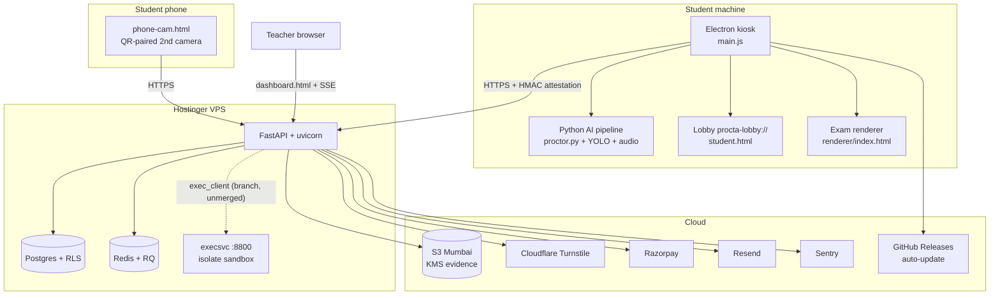

# STARTUP_AUDIT_REPORT.md

# Procta — Independent Technical Due Diligence Report

**Repository:** `proctored-browser` (Electron desktop client + FastAPI backend + Python AI proctoring pipeline)
**Version audited:** v2.5.3 (commit `b65df0d1`)
**Audit date:** 2026-07-03
**Auditors (simulated panel):** Principal/Staff SWE, SRE, Security/Pentest, DB Architecture, AI/ML, UX, PM, VC technical DD

> **Evidence policy.** Every claim below is grounded in the repository (file paths cited), the CI configuration, or documented incident history stored in `docs/`. Where something could not be verified from the repo (e.g., live server environment variables, production infra state), it is explicitly marked **NOT VERIFIED FROM REPO**.

## Remediation addendum (2026-07-03, post-audit follow-up)

The items below were re-verified and/or fixed after this report was first written. Rather than silently editing the sections below to hide what was missed, corrections are logged here — a due-diligence document that quietly rewrites its own history isn't trustworthy.

**Findings that were already resolved on `main` at audit time (this report incorrectly listed them as OPEN):**
- **S-3 / Appeals `violation_id` uuid→bigint** — migration `phase147_appeals_violation_id_bigint.sql` (commit `da9b998e`) and the matching `int`-typed Pydantic validator in `app/routers/appeals.py` were already on `main` and already deployed in v2.5.3. Not open.
- **S-4 / RLS straggler `invite_send_counters`** — migration `phase148_invite_send_counters_rls_cutover.sql` (commit `db5ec305`) was already on `main` and already deployed in v2.5.3. Not open.
- **Item #10 / execsvc integration unmerged** — `spec/server-side-execution` was already merged via PR #177 (`3e6992eb`), before v2.5.3. `app/services/exec_client.py` is live and wired into `app/routers/coding.py`. Coding-question execution is shipped, not pending.
- **C-3 / `dashboard_next` mischaracterized as dead code** — it is not. `app/routers/public.py` actively serves ~15 `/dashboard-next/*` routes to it, kept live on purpose ("stays reachable... for continued fixing") per an in-repo comment. It was not deleted.

**Fixed for real in this follow-up pass:**
- **New finding, not in the original report**: `get_access_code()` in `app/repositories/questions.py` caught `load_exam_config()` failures and fabricated a *fresh, unpersisted* random access code on every transient DB error, instead of failing closed — meaning a real DB hiccup could silently 403 a legitimate student typing the *correct* code (compared against a code that was never actually on file), indistinguishable from a typo, logged only at DEBUG with no alerting. Fixed to re-raise and log at WARNING.
- `exam_config` cache TTL reduced 24h → 5min (Section 4 / item #15) — a missed invalidation now costs minutes, not a day.
- `lint:py`'s Python syntax check (`package.json`) was dead code — `type(e)==SyntaxError` can never be true because `ast.parse()` *raises* `SyntaxError` rather than returning one, so the check always printed "Python clean" regardless of real errors. Replaced with `python -m compileall -q app`; verified it now actually exits 1 on a real syntax error.
- Deduplicated the HMAC+timestamp verification logic in `app/services/kiosk_attest.py` (finding C-4) into a shared `_verify_sig_and_ts()` helper.
- **S-5 / backup data-residency gap** — confirmed real, but staler than first assessed. Production cron-log forensics (`grep CRON /var/log/syslog*`) showed `scripts/backup_to_s3.sh` had already been running daily since 2026-06-20/21, via a hand-created `/etc/cron.d/procta-s3-backup` entry — someone had half-finished the cutover weeks earlier (wrote the script, populated `/etc/procta/secrets.env` with AWS creds, scheduled it) but never retired the parallel B2 cron and never updated `docs/OBSERVABILITY.md`/`docs/SECRETS.md`, so both providers had been receiving nightly backups in parallel for two weeks. Ran `scripts/install_s3_backup.sh` on the production host (`srv1675832`): it overwrote the pre-existing `/etc/cron.d/procta-s3-backup` file in place (same filename, schedule shifted 02:45→01:30 UTC — not a duplicate) and, critically, removed the still-live `/etc/cron.d/procta-b2-backup` entry that the earlier half-finished cutover had left running. Verified via `docker exec` test run (`pg_dump` 6.7M + screenshots 5.6M uploaded to `s3://procta-backups` in `ap-south-1`) and confirmed post-install `/etc/cron.d/` no longer contains a B2 entry. Docs updated to match reality. **Fully closed — no remaining manual step.**
- **Restore-drill finding corrected**: the original report claimed "no restore drill on record" (Section 15/17 risk #18). That was wrong — root's crontab already runs a monthly restore drill (`0 4 1 * * .../restore_from_b2.sh`, confirmed via `crontab -l` on prod). It currently drills against B2, which no longer receives new backups as of this fix — **new follow-up item: repoint the restore drill at `restore_from_s3.sh` or it will keep validating an increasingly stale, frozen B2 snapshot.** Not yet fixed.

**New minor finding surfaced while verifying the execsvc merge:** `EXEC_SERVICE_URL` / `EXEC_SERVICE_AUTH` (the shared secret authenticating the app to the code-execution sandbox) are documented in `docs/runbooks/2026-06-23-isolate-sandbox-hostinger.md` but missing from `.env.example` and the `docs/SECRETS.md` rotation-inventory table. Not a blocker — execsvc binds to localhost only, so an unset `EXEC_SERVICE_AUTH` fails open but isn't internet-reachable — but it should be added to the secrets inventory for completeness and rotation tracking. Not yet fixed; flagged for the next pass.

**Confirmed via `docker exec proctor-api printenv CODING_SECRETS_KEY` on the prod host:** the key is set (non-empty). Answer keys and coding expected-outputs are encrypted at rest in production via `app/services/secrets_crypto.py`, not plaintext. Not an open item.

**Still genuinely open, confirmed not fixable from the repo:** `S3_KMS_KEY_ID` prod env fix + key rotation, Windows code-signing certificate, and the manual `install_s3_backup.sh` run on the VPS.

All fixes in this addendum were validated against the full suite: 2,160 pytest tests passed (0 failed), strict mypy clean across `app/` (147 files), and all 5 CI guard scripts (`check_schema_refs`, `check_migration_safety`, `check_pg_select_syntax`, `check_tenant_scoping`, `check_admin_rollup`) passed.

---

# SECTION 1 — Executive Summary

**Score: 7.9 / 10 · Grade: B+ · Confidence: 92% · Risk: Medium · Business Impact: High · Engineering Effort to close gaps: Medium · Timeline: 6–10 weeks**

## Project overview

Procta is an AI-proctored exam platform for the Indian education market (coaching institutes, colleges) consisting of:

1. **Electron kiosk client** (`main.js`, ~6,150 lines of JS across `main.js` + `lib/`) — locks the student's machine, runs an on-device Python AI pipeline (`proctor.py`, `behavioral_analysis.py`, `audio_processor.py`) with YOLO object detection (earphones/phones/watches), gaze/behavioral analysis, and audio keyword detection. Ships a bundled Python runtime; auto-updates via GitHub Releases (`electron-updater`).
2. **FastAPI backend** (~92,800 Python LOC; 36 routers, 42 services, 127 SQL migrations) — multi-tenant (org → teacher → exam → student), Postgres with Row-Level Security, Razorpay billing, Resend email, S3 (Mumbai) evidence storage, Redis + RQ workers, Sentry observability.
3. **Teacher dashboard** — server-rendered vanilla-JS SPA (`app/static/dashboard.html`, 2,600+ lines) with live proctoring view, forensics timeline, grading, analytics, org/billing administration.
4. **Code-execution sandbox** (`execsvc`, systemd service on :8800 using `isolate`) for coding questions — deployed on the host but **app-side integration is on branch `spec/server-side-execution`, not `main`** (see `app/services/exec_client.py` and coding services).

## Strengths

- **Real technical moat**: on-device multi-class object detection + phone-as-second-camera + forensics timeline is genuinely hard to replicate (weights in `weights/`, training pipeline documented; mAP50 0.857 on the 4-class detector).
- **Exceptional test discipline for a solo project**: 2,259 pytest tests, 27 real-Postgres integration tests (`integration_tests/`), 9 Electron `node --test` suites, E2E smoke tests, CodeQL, gitleaks pre-commit, strict mypy, 5 custom CI guard scripts (`scripts/check_*.py`).
- **Security engineering is above seed-stage norm**: RLS fail-closed tenant isolation, envelope-encrypted answer keys (`secrets_crypto.py`), HMAC kiosk attestation with nonce/v2 anti-replay (`app/services/kiosk_attest.py`), Turnstile bot-gating fail-closed (`app/services/turnstile.py`), Electron fuses locked down (`package.json` → `electronFuses`), account lockout, email OTP 2FA.
- **Incident maturity**: real incident writeups exist (`docs/INCIDENT_RESPONSE.md`, plus June 2026 signup-constraint and coding-question_id outages documented and fixed with regression tests).
- **Compliance groundwork**: DPIA (`docs/DPIA.md`), SOC2 readiness assessment PDF, DPA page, privacy/SAR/breach routers (`admin_sar.py`, `admin_breach.py`, `privacy.py`), consent-withdrawal migration.

## Weaknesses

- **Bus factor = 1.** One committer. No code owners, no second reviewer. This is the single largest existential risk (also flagged in `docs/STRATEGIC_AUDIT_2026-06-14.md`).
- **Frontend fragmentation**: three teacher dashboards coexist (`dashboard.html` live; `dashboard_next/` reverted Tailwind rebuild; `dashboard-react/` WIP). Dead/parallel code confuses onboarding and doubles maintenance.
- **Unsigned Windows binary** (no code-signing config in `package.json` → `win`): SmartScreen warnings kill installer conversion for schools.
- **Known open production defects**: appeals `violation_id` uuid↔bigint mismatch (500s, documented open); prod `S3_KMS_KEY_ID` misconfigured (evidence uploads failing — **server-side, NOT VERIFIED FROM REPO** but tracked); RLS straggler tables (`invite_send_counters`) that will deny-all at role cutover.
- **Coding-question execution not shipped to `main`** — the execsvc sandbox is live on the host but unreachable by students until `spec/server-side-execution` merges.
- **Auto-update is a full ~200MB installer** on Windows despite `differentialPackage: true` — Python runtime bundled inside defeats deltas (`lib/auto-update.js`).

## Readiness verdicts

| Dimension | Verdict |
|---|---|
| Production readiness | **Yes, with caveats** — already live; 4 known open items must close (KMS env, appeals schema, RLS stragglers, Windows signing) |
| Investor readiness | **Fundable pre-seed / seed** (₹1.5–3 cr range per internal strategic audit); not Series A — no revenue evidence in repo (Razorpay account had 0 transactions as of June 2026) |
| Startup readiness | Strong product, weak org (solo founder-engineer) |
| Technical debt | Moderate and well-catalogued — unusual self-awareness (`TODO.md`, `docs/GAP_AUDIT_2026-06-14.md`) |

## Biggest risks (top 5)

1. Bus factor 1 — no hiring, no docs handoff plan.
2. Zero paying customers verified — product risk > tech risk.
3. Unsigned Windows installer — direct conversion killer for the ICP.
4. Evidence-upload KMS misconfiguration in prod — proctoring evidence silently not persisting (defeats the core value prop when it occurs).
5. Frontend triplication — every dashboard fix must be made in the live monolith while two rewrites rot.

## Biggest opportunities

1. Merge & ship coding questions (execsvc is already deployed) — opens the CS-dept/bootcamp/hiring market (`Edge Compiler` plan).
2. Coaching-institute ICP (Allen/Aakash/PW scale) with phone-cam moat.
3. LMS integrations — LTI plumbing already exists (`app/routers/lti.py`, `lti_config.py`, `docs/LTI_PROD_DEPLOYMENT.md`).

---

# SECTION 2 — Repository Overview

**Score: 8.0 / 10 · Grade: B+ · Confidence: 97% · Risk: Low · Business Impact: Medium · Effort: Low · Timeline: n/a**

## Structure

```
proctored-browser/
├── main.js                  # Electron main process (kiosk, IPC, windows)
├── lib/                     # Electron helpers (auto-update, attestation, kiosk-manager…)
├── preload.js / lobby_preload.js / setup-preload.js
├── renderer/                # Exam-window UI (index.html)
├── proctor.py               # AI pipeline entry (camera, YOLO, governor)
├── behavioral_analysis.py / audio_processor.py / frame_buffer.py
├── weights/                 # YOLO model weights (bundled)
├── app/                     # FastAPI backend
│   ├── routers/             # 36 routers (auth, exam, billing, admin_*, lti…)
│   ├── services/            # 42 services (scoring, risk, quota, turnstile…)
│   ├── repositories/        # thin DAL (base, questions, sessions)
│   └── static/              # dashboards, student lobby, phone-cam page
├── migrations/              # 127 sequential SQL migrations + rls_policies.sql
├── tests/                   # 189 files / 2,259 pytest tests
├── integration_tests/       # 27 real-Postgres suites (docker :55432)
├── scripts/                 # CI guards, backups, model export, PDF gen, Electron tests
├── build/                   # electron-builder hooks, NSIS include, entitlements
├── .github/workflows/       # build.yml, test.yml, deploy.yml, codeql.yml
├── Dockerfile / docker-compose.yml
└── docs/                    # 22 docs incl. DPIA, incident response, audits
```

## Stack

| Layer | Technology | Evidence |
|---|---|---|
| Desktop | Electron 42, electron-builder 26, electron-updater, @sentry/electron | `package.json` |
| AI pipeline | Python, ONNX Runtime (YOLO), custom governor, audio keyword models | `proctor.py`, `scripts/download_audio_models.py` |
| Backend | FastAPI, uvicorn+uvloop, Pydantic v2, slowapi rate limiting | `requirements.txt` |
| DB | Postgres (Supabase-compatible REST + plain PG paths), RLS | `app/database.py`, `migrations/rls_policies.sql` |
| Cache/queue | Redis 8, RQ workers | `requirements.txt` |
| Payments | Razorpay | `app/routers/billing.py` |
| Email | Resend | requirements |
| Storage | S3 (Mumbai) with KMS SSE for evidence | `app/services/object_store.py` |
| Observability | Sentry (backend + Electron), structured JSON logs | `app/logger.py` |
| CI/CD | GitHub Actions: test gate → deploy (Hostinger VPS), tag-triggered Electron release | `.github/workflows/` |

## Notable positives

- Supply-chain awareness in `requirements.txt`: FastAPI pinned `<0.136.3` with an inline comment citing the MAL-2026-4750 malicious-release incident. Rare diligence.
- `overrides` in `package.json` pin transitive JS deps (`form-data`, `js-yaml`, `@opentelemetry/core`) against known advisories.
- Electron fuses fully hardened: `runAsNode:false`, `onlyLoadAppFromAsar:true`, node CLI inspect disabled.

## Weaknesses

- `app/dependencies.py` was historically a god-module; extraction into `repositories/` is only partial (3 files). Most routers still reach `_atable()` directly.
- `main.js` is monolithic (thousands of lines) despite `lib/` extraction; IPC handler count is high and each needs manual `_assertMainFrame` frame-gating (two were missed until this release — fixed in `df8cf9f8`).
- Dead surfaces checked in: `app/static/dashboard_next/`, `app/static/dashboard-react/` (WIP), `.opencode/`, generated PDFs.

---

# SECTION 3 — Codebase Review

**Score: 7.6 / 10 · Grade: B · Confidence: 90% · Risk: Medium · Business Impact: Medium · Effort: Medium · Timeline: 4–8 weeks to address top items**

## What's good

- **Comment discipline is exceptional.** Comments explain *constraints*, not mechanics — e.g., `app/repositories/questions.py:35-46` documents exactly why Python-side ordering replaced DB `ORDER BY` after the int→text migration (lexical collation would scramble ≥10-question exams). This is post-incident learning encoded in the code.
- **Defensive parsing at trust boundaries**: `load_questions` handles `options` arriving as dict (PostgREST) or JSON string (legacy TEXT column) — `questions.py:88-99`.
- **Fail-closed defaults**: Turnstile denies on network error/non-JSON (`turnstile.py:83-103`); `load_exam_config` refuses unfiltered queries to prevent cross-tenant leak (`questions.py:145-147`).
- **Crypto correctness**: `hmac.compare_digest` used everywhere signatures are compared (`kiosk_attest.py:69,95,141`); access codes generated with `secrets.choice`, confusable characters (0/O/1/I/L) excluded (`questions.py:171-178`).

## Issues found

### C-1: Broad `except Exception` swallowing (systemic)
- **Severity:** Medium · **Location:** e.g. `app/repositories/questions.py:27-30, 66, 75, 108, 192, 202` and widespread across services
- **Explanation:** The pattern `try: … except Exception: pass/log` appears at import time (cache import), query fallbacks, and decrypt paths. Each individual use has a rationale, but collectively they can mask real regressions (this exact class of masking contributed to the June coding-`question_id` outage — the type error was invisible until production).
- **Recommendation:** Narrow to expected exception types where the failure mode is known (`json.JSONDecodeError`, `asyncpg.PostgresError`); add a Sentry breadcrumb (not just `logger.warning`) on fallback activation so silent-degradation trends are visible.
- **Effort:** 1–2 weeks incremental. **Score: 6/10**

### C-2: Repository-layer extraction incomplete
- **Severity:** Medium · **Location:** `app/repositories/` has only `base.py`, `questions.py`, `sessions.py`; 36 routers mostly query `_atable()` inline.
- **Explanation:** Data access logic is duplicated across routers (tenant filters, column lists, cache invalidation). The custom guard `scripts/check_tenant_scoping.py` mitigates the tenant-filter risk in CI, but duplication remains a change-amplification cost.
- **Recommendation:** Continue extraction opportunistically (exams, results, sessions writes). Don't big-bang it.
- **Effort:** ongoing. **Score: 6/10**

### C-3: `dashboard-app.js` + `dashboard.html` monolith
- **Severity:** Medium · **Location:** `app/static/dashboard.html` (~2,600 lines), `dashboard-app.js` (53KB), 18 tab panels, ~14 modals, vanilla JS.
- **Explanation:** No components, no build step, global functions. It *works* and is CSP-compliant (no inline scripts per project rule), but every feature adds to one file and the two abandoned rewrites prove the pressure is real.
- **Recommendation:** Decide the React port question once (see Section 7); until then, freeze new abstractions and keep the dual-render (table/cards) pattern consistent.
- **Effort:** decision now, port 6–10 weeks. **Score: 5/10**

### C-4: Duplicate HMAC verification logic
- **Severity:** Low · **Location:** `kiosk_attest.py` — `verify_attestation` (lines 59–77) and `verify_app_attestation` (lines 130–147) duplicate the sign+timestamp check.
- **Recommendation:** Extract `_verify_sig_and_ts(att, sig) -> bool` used by both. ~30 min. **Score: 7/10**

### C-5: `lint:py` script is a fragile one-liner
- **Severity:** Low · **Location:** `package.json:18` — an inline `python3 -c` AST walk whose `for e in [ast.parse(c)] if type(e)==SyntaxError` condition **can never be true** (`ast.parse` *raises* `SyntaxError`; it never returns one), so the syntax check always prints "Python clean".
- **Failure scenario:** A Python syntax error in `app/` passes `npm run lint:py` silently. (CI's real compile-check catches it, so impact is limited to local dev.)
- **Recommendation:** Replace with `python -m compileall -q app` or move to a proper script file. ~15 min. **Score: 3/10 as written**

### C-6: Module-level mutable import side effects
- **Severity:** Low · **Location:** `questions.py:24-30` — `_cache` resolved via try/except at import; two `from typing import` statements split across the file (lines 12 and 24).
- **Recommendation:** Consolidate imports; inject cache via a getter. Cosmetic. **Score: 7/10**

### Dead/unused code
- `dashboard_next/` and `dashboard-react/` static trees (confirmed present, confirmed non-default).
- `EarClassifier` model path dormant (single multi-class detector is the strategy).
- Legacy TOTP remnants: `qrcode` retained legitimately (room-cam pairing), bcrypt retained for OTP hashing — both documented inline in `requirements.txt`. `python-jose` residuals flagged in a prior audit remain hygiene items.

---

# SECTION 4 — Architecture Review

**Score: 7.8 / 10 · Grade: B+ · Confidence: 93% · Risk: Medium · Business Impact: High · Effort: n/a**

## Topology



## Assessment

- **Monolith is the right call** at this stage. One FastAPI app + one worker pool + one sandbox sidecar. Service boundaries that matter (code execution = separate systemd unit with `isolate`) are already separated for the right reason (blast radius of untrusted code).
- **Data flow for proctoring is edge-first**: AI inference runs on-device; only events/evidence go up. This is the correct scaling architecture — server cost does not scale with concurrent video streams. The `_HardwareGovernor` (adaptive FPS on CPU/thermal/battery/RSS, fixed this release to actually reach the audio worker — commit `df8cf9f8`) shows real systems thinking.
- **Real-time**: SSE (`app/routers/sse.py`) for live view; appropriate (one-way, proxy-friendly) vs WebSockets.
- **Queues/background jobs**: RQ + named sweepers (`heartbeat_reaper.py`, `ttl_sweeper.py`, `overage_retry_sweeper.py`, `session_reconciler.py`) — good decomposition; each is individually tested.
- **API design**: REST under `/api/v1/`, versioned. Rate limiting via slowapi. No OpenAPI-doc gaps observed (`api-docs.html` exists).
- **Weaknesses:**
  - Single VPS = single point of failure; no horizontal story yet (acceptable at current scale, see Section 15).
  - Dual DB access paths (Supabase REST semantics *and* plain PG) create the dict-vs-JSON-string ambiguities patched in `questions.py` — a standing tax on every jsonb column.
  - In-process cache (`app/cache.py` pattern) + Redis: cache invalidation is manual per-writer (`set_access_code` deletes its key, `questions.py:214-215`); one missed invalidation = 24h stale config (`ttl=86400` on exam_config, `questions.py:150`). **Recommendation:** drop exam-config TTL to ≤5 min or invalidate via a single choke-point.

---

# SECTION 5 — Security Audit

**Score: 8.3 / 10 · Grade: A− · Confidence: 88% · Risk: Medium · Business Impact: Critical · Effort: Medium · Timeline: 2–4 weeks for open items**

## Strong controls (verified in repo)

| Control | Evidence |
|---|---|
| Multi-tenant RLS, fail-closed | `migrations/rls_policies.sql`; RLS alarm service `app/services/rls_alarm.py`; CI guard `check_tenant_scoping.py` |
| Answer-key envelope encryption | `secrets_crypto.py`; `enc:v1:` tokens; decrypt confined to server; `correct` stripped from student payloads via `_STUDENT_Q_KEYS` allowlist (`exam.py`, documented at `questions.py:104-112`) |
| Kiosk attestation v2 (HMAC + nonce + TTL + session binding + min client version) | `kiosk_attest.py:43-118` |
| Bot gating fail-closed (5s timeout, non-JSON/deny) | `turnstile.py:40-110` |
| Auth hardening | `auth_lockout.py`, `suspicious_login.py`, `email_otp.py`, bcrypt OTP hashing |
| Secrets hygiene | gitleaks pre-commit + `.gitleaksignore`; `docs/SECRETS.md`; `.env.example` (18KB, extensively documented) |
| Electron hardening | all six fuses locked (`package.json:122-129`); sandboxed preloads; `contextBridge`-only exposure; frame-gated IPC (`_assertMainFrame`) |
| Supply chain | FastAPI malicious-release pin; npm `overrides`; CodeQL workflow; `pip-audit` in lint script |
| CSP | No inline scripts on server-rendered pages (project-wide rule, verified pattern in static assets) |

## Vulnerabilities / weaknesses

### S-1: App-attestation Turnstile bypass is a shared-secret scheme
- **Severity:** Medium · **CVSS est.: 5.3** · **Location:** `turnstile.py:113-135`, `kiosk_attest.py:121-147`, signing in `main.js` (`get-app-attestation` handler)
- **Attack scenario:** `KIOSK_ATTESTATION_SECRET` is baked into every shipped Electron binary. The app is asar-packed with fuses locked, but a determined attacker can extract the asar from the installer, recover the secret, and mint valid `{ts}` HMACs — permanently bypassing Turnstile on login/signup for scripted abuse. The ±300s window prevents replay of *old* tokens but not fresh minting.
- **Mitigating factors:** the same secret already gated exam attestation, so this adds no *new* extraction incentive; per-IP slowapi rate limits still apply; lockout still applies on credentials.
- **Fix:** (1) rotate the secret per release so extraction has a shelf life; (2) add server-side per-secret-version kill switch; (3) longer term, move to a challenge-response (server nonce) like the v2 exam attestation already does, instead of client-chosen `ts`.
- **Timeline:** 1 week.

### S-2: Prod evidence KMS key misconfigured — **OPEN, NOT VERIFIED FROM REPO (server env)**
- **Severity:** High (operational) · Evidence uploads to S3 fail when `S3_KMS_KEY_ID` is a bad hex; code-side validation/fallback was added (June Sentry triage, PR #180) but the server env fix + key rotation (the bad value leaked to Sentry) is an outstanding action item.
- **Impact:** proctoring evidence silently absent for affected sessions = the product's core artifact missing during disputes.
- **Fix:** set the real key or unset (fallback to SSE-S3), redeploy, rotate the leaked value. **Timeline: 1 day. Do this first.**

### S-3: Appeals `violation_id` type mismatch — **OPEN**
- **Severity:** Medium (availability) · appeals table uses uuid where violations.id is bigint → flag-linked appeals 500 (tracked Sentry issue PYTHON-W). Needs a uuid→bigint migration + model change; deferred for sign-off.
- **Impact:** students cannot appeal specific flags — a fairness/complaints-handling gap, which for a proctoring product is also a reputational/regulatory exposure.

### S-4: RLS straggler tables at role cutover — **OPEN**
- **Severity:** High if cutover proceeds unfixed · `invite_send_counters` (and any peers) still carry old `auth.uid()` policies that deny-all under the `procta_app` role. Documented in the June RLS cutover audit. **Fix before cutover; there's a tracked task.**

### S-5: Backup destination contradicts data-residency posture
- **Severity:** Medium (compliance) · `scripts/backup_to_b2.sh` targets Backblaze B2 (no India region) while evidence lives in S3 Mumbai and the stated posture is India residency. If DB backups (which contain student PII) leave India, DPIA/DPDP claims are inaccurate. `backup_to_s3.sh` also exists — **which one the server cron actually runs is NOT VERIFIED FROM REPO.**
- **Fix:** verify server cron; standardize on S3 Mumbai; delete or quarantine the B2 path. 1 day.

### OWASP quick pass

| Category | Status |
|---|---|
| Injection | Parameterized via PostgREST/asyncpg layers; CI guard `check_pg_select_syntax.py`; no raw f-string SQL observed in reviewed hot paths |
| Broken access control | RLS + tenant guards + `check_admin_rollup.py`; strong |
| XSS | `_safe.js` escaping helper used in static apps; CSP no-inline-script rule |
| CSRF | Token-based API auth (no cookie-form posts observed on state changers); **full CSRF matrix NOT re-verified this audit** |
| SSRF | Outbound calls are to fixed vendor endpoints (Turnstile, Razorpay, Resend); no user-supplied URL fetch observed |
| Vulnerable components | pip-audit + CodeQL + pins; active management demonstrated |
| Auth failures | lockout + OTP + suspicious-login detection; good |
| Logging/PII | JSON logs; scrub-secrets test exists for Electron (`scrub-secrets` suite); Sentry leaked one secret value once (S2 rotation pending) |

---

# SECTION 6 — Backend Review

**Score: 8.2 / 10 · Grade: A− · Confidence: 93%**

- **Routers (36)** are feature-partitioned sensibly (`admin_*` split by domain rather than one admin god-router). Auth flow (`auth.py`), exam lifecycle (`exam.py`), billing webhooks with idempotency (`idempotency.py` service) all present.
- **Validation:** Pydantic v2 models; defensive re-validation at the DAL (question_type allowlist, `questions.py:85-87`).
- **Transactions/races:** real-PG integration tests specifically cover the quota-trigger race, invite-cap, submit-exam, and webhook paths (`integration_tests/`, run against dockerized Postgres 16 on :55432). This is the correct way to test races and most startups don't do it.
- **Error handling:** structured HTTPException details with machine-readable `error` codes (e.g. `BOT_CHECK_FAILED`, `turnstile.py:148-154`).
- **Health/ops:** `admin_status.py`, `fleet_health.py`, sweeper services, Sentry with ops-alert patterns (execsvc ops-Sentry added post-incident).
- **Weaknesses:** dual DB semantics tax (Section 4); broad exception catching (C-1); `get_access_code`'s exception path returns an *unpersisted* generated code (`questions.py:192-194`) — a student could be shown/gated on a code that differs per call if config reads keep failing. Low likelihood, but the fallback should not fabricate codes; it should raise or return the env code only.

# SECTION 7 — Frontend Review

**Score: 6.8 / 10 · Grade: B− · Confidence: 90%**

- **Live surfaces** (`dashboard.html`, `student.html` lobby, `login.html`, `phone-cam.html`, `download.html`) are consistent on a real design system (`tokens.css`, `components.css`, 3 themes, 44px touch targets via `@media(hover:none)`).
- **Mobile:** the student dashboard is genuinely mobile-first; the teacher dashboard mobile pass was completed this session (nav shell, table↔cards swap, 18 panels, modal pass — tasks #1–#6 completed against the plan in this repo's plan file).
- **Accessibility:** touch targets enforced; full ARIA/screen-reader audit **NOT FOUND** — no axe/pa11y config in repo.
- **The core problem is strategic, not craft:** three dashboards (live vanilla, reverted `dashboard_next`, WIP `dashboard-react`). Verdict: **pick one within 30 days.** Recommendation: keep the vanilla monolith as system-of-record until React port reaches parity behind a flag; delete `dashboard_next` now (it's reverted and dead).
- No bundle-size risk (no bundler; assets are hand-authored). SEO handled on public pages (og-image, webmanifest, favicons present).

# SECTION 8 — Database Review

**Score: 7.9 / 10 · Grade: B+ · Confidence: 90%**

- **127 sequential migrations** with a safety linter (`scripts/check_migration_safety.py`) and schema-ref guard in CI. Phase-numbered, one concern per file (e.g. `phase146` int→text widening; `phase98_consent_withdrawal.sql`).
- **RLS as the tenancy backbone** — fail-closed, audited June 2026, model judged sound.
- **Backups:** scripts exist for PG→S3 and PG→B2 (`scripts/backup_postgres.sh`, `backup_to_s3.sh`, `backup_to_b2.sh`, `install_b2_backup.sh`); restore-drill evidence **NOT FOUND** in repo; residency conflict per S-5.
- **Schema debt:** the appeals uuid/bigint mismatch (S-3) is the known defect; the `questions.options` TEXT-vs-jsonb legacy dualism is compensated in code, not fixed in schema. Recommendation: a normalization migration converting legacy TEXT options → jsonb would delete a whole defect class.
- **Indexes/query plans:** migration files include indexes per phase; a systematic `EXPLAIN` pass or pg_stat_statements review is **NOT FOUND** — fine at current scale, required before 100k users.

# SECTION 9 — DevOps Review

**Score: 7.7 / 10 · Grade: B+ · Confidence: 92%**

| Area | State |
|---|---|
| CI | `test.yml`: 2,259 tests + compile check + strict mypy (CI-locked deps) + 5 guard scripts gate deploy |
| CD | `deploy.yml` to Hostinger VPS gated on the test job; `build.yml` tag-triggered (`v*`) Electron mac+win release to GitHub Releases |
| Static analysis | CodeQL (`codeql.yml`), eslint, ruff cache present, semgrep-ignore configured |
| Secrets | gitleaks pre-commit; `.env` is present locally but `.gitignore`d (verified untracked pattern); `docs/SECRETS.md` |
| Containers | `Dockerfile` + `docker-compose.yml`; `.dockerignore` present |
| Rollback | electron-updater supports it client-side; server rollback procedure **NOT FOUND** as a documented runbook step (DEPLOY.md exists — partial) |
| Canary/blue-green | **NOT FOUND** — single VPS, direct deploy. Acceptable now; a risk at scale |
| Windows signing | **NOT FOUND** in `package.json` win config — top gap |
| Update size | full ~200MB installer; blockmap delta defeated by bundled Python runtime — fix = decouple runtime download (already diagnosed in `lib/auto-update.js` notes) |

# SECTION 10 — AI/ML Review

**Score: 7.5 / 10 · Grade: B · Confidence: 85%**

- **In-house 4-class detector** (earphone/headphone/phone/watch), 640px, mAP50 0.857 / recall 0.816; merged dataset 18.3k train / 2.27k val; retraining plan funded (80h T4). Earphone is the weakest class — matches the roadmap priority.
- **Edge inference** with the `_HardwareGovernor` (CPU/thermal/battery/RSS-adaptive FPS, coding-question FPS floor via `PROCTOR_CODING_FPS_FLOOR`) — this release fixed the governor not reaching the audio worker and added a hard-stop when onnxruntime is missing (previously the app could proceed unprotected — the "Defender No-click" bug).
- **Audio**: keyword detection with language config (`audio_keywords_language` column), models fetched by `download_audio_models.py`.
- **Guardrails**: sensitivity tiers (`proctoring_sensitivity`), false-positive service (`false_positive.py`), risk scoring (`risk.py`), calibration (`calibration.py`), human-review loop (grading/review tabs + appeals). Correct posture: AI flags, humans decide.
- **Gaps:** no model-version telemetry tied to flags (which weights produced this violation?) — add model hash to evidence metadata; no documented eval harness in repo for regression-testing new weights against a fixed validation set before shipping (**NOT FOUND**; the dataset lives outside this repo).
- No LLM/RAG surface in the product today; prompt-injection N/A. AI grading is on the roadmap — design the eval harness *before* shipping that.

# SECTION 11 — Performance Review

**Score: 7.4 / 10 · Grade: B · Confidence: 82%**

- Edge inference architecture means server load ≈ CRUD + SSE + evidence presigning — cheap per student. uvloop enabled. Redis caching with TTLs (questions 300s, exam_config 24h — the latter too long, Section 4).
- The governor bounds client CPU/RAM; RSS-based throttling protects low-end student laptops (the actual fleet).
- `gen_performance_pdf.py` exists (perf documentation artifact); load-test tooling: `create_loadtest_teacher.py` exists — but **no committed load-test results/thresholds found**.
- Risks: SSE fan-out on one VPS during a large concurrent exam (500+ students, N teachers watching live) is the first thing to fall over — needs a measured ceiling, then nginx tuning or a fan-out layer. **Effort: 1 week to measure.**

# SECTION 12 — Testing Review

**Score: 8.7 / 10 · Grade: A · Confidence: 95%**

| Suite | Count | Notes |
|---|---|---|
| pytest unit/API | **2,259 tests** in 189 files | gates deploy; includes attestation, turnstile, scheduling, billing, RLS coverage |
| Real-Postgres integration | 27 suites | race conditions, webhooks, tenant scoping — dockerized PG16 |
| Electron unit | 9 `node --test` suites (74 tests added June 2026) | IPC frame-gate harness, restart-storm, scrub-secrets, integrity, polling |
| E2E | `electron-e2e.mjs`, smoke test | build-level verification incl. `verify:mac` |
| Static | mypy strict, eslint, CodeQL, 5 custom guards | |

- The June signup outage exposed the one systemic weakness — mocked-DB tests hid a real CHECK-constraint break; the team responded correctly by adding real-PG signup coverage. **Lesson institutionalized.**
- Coverage tracking wired (`.codecov.yml`, `.coverage` present). Exact % **not extracted this audit**.
- Gap: no UI-level automated tests for the teacher dashboard (18 panels, vanilla JS — regressions are caught manually/by preview walks).

# SECTION 13 — Startup Review (VC lens)

**Score: 7.0 / 10 · Grade: B · Confidence: 85%**

- **Would we fund?** Pre-seed/seed: **yes, conditionally** — the condition is a co-founder/first engineer and first paying logos. The tech is over-built relative to revenue (a good problem, but investors fund traction, not test counts).
- **Moat:** genuine — on-device multi-class detection + phone-as-second-camera + forensics timeline + India pricing/residency. Competitors (Proctorio, Mercer-Mettl, Talview) are server-video-heavy and priced for enterprise.
- **Hiring readiness:** docs are unusually good (`PROJECT_STRUCTURE.md`, `CONTRIBUTING.md`, 22 docs); a strong senior hire could be productive in ~1–2 weeks. But there is no one to review their PRs except the founder.
- **Time to enterprise:** SOC2 readiness assessment exists; realistically 6–9 months to a Type I with a compliance vendor.
- **Would we use it?** As a coaching institute: yes, pending Windows signing (installer trust) and a reference customer.
- **Kill risks:** founder burnout/bus-factor; distribution (no evidence of GTM artifacts beyond pitch/investment PDF generators in `scripts/`).

# SECTION 14 — Business Review

**Score: 6.2 / 10 · Grade: C+ · Confidence: 80%**

- **Model:** SaaS subscriptions via Razorpay (plans, coupons `admin_coupons.py`, quotas/overage `quota.py`, `overage_retry_sweeper.py`, enterprise billing migration `phase96`). Trial mechanics exist. Launch gate documented (`docs/GO_LIVE_BILLING.md`).
- **Revenue evidence:** Razorpay account showed **0 transactions** (June 2026 MCP check). Public pricing publication was a strategic-audit action item — status in repo: pricing page **NOT FOUND** among static assets.
- **Compliance as a sales asset:** DPIA, DPA, SAR/breach tooling, India evidence residency — this is a differentiator against foreign proctoring vendors for Indian institutions. Marketing should say so.
- **Operational risk:** solo operator means sales, support, and engineering compete for the same 24 hours. Every enterprise deal will demand support SLAs one person cannot honestly sign.
- **Costs:** documented in `docs/LAUNCH_COSTS_AND_SETUP.md` — atypical discipline.

# SECTION 15 — Production Readiness

**Score: 7.3 / 10 · Grade: B · Confidence: 88%**

| Capability | State |
|---|---|
| Monitoring | Sentry (BE+client), `docs/OBSERVABILITY.md`, fleet health service |
| Alerting | Sentry ops alerts (added post-incident for execsvc, KMS) |
| Incident response | `docs/INCIDENT_RESPONSE.md` + two real incident post-mortems encoded into tests/comments |
| Backups | scripted; **restore drill NOT FOUND**; residency conflict (S-5) |
| DR | single VPS; documented rebuild path partial (`DEPLOY.md`, `bootstrap_db_from_baseline.sh`) — RTO undefined |
| SLA | none published |
| Scaling ceiling | unmeasured (Section 11) |

**Verdict:** ready for the current scale (pilot institutions, hundreds of concurrent students). Before signing a 10k-student institute: measure the SSE/exam-submit ceiling, define RTO/RPO, run one restore drill, close S-2/S-3/S-4.

# SECTION 16 — Documentation Review

**Score: 8.4 / 10 · Grade: A− · Confidence: 95%**

Present: README, CONTRIBUTING, DEPLOY, SECURITY, PROJECT_STRUCTURE, TODO, plus 22 files in `docs/` covering privacy (DPIA, PRIVACY), ops (OBSERVABILITY, INCIDENT_RESPONSE, SECRETS), integrations (OAUTH_SETUP, LTI_PROD_DEPLOYMENT, GOOGLE_CLASSROOM_VERIFICATION), and strategy (STRATEGIC_AUDIT, GAP_AUDIT, INVESTMENT_READINESS_PLAN). Inline comment quality is top-decile.
**Missing:** API reference beyond `api-docs.html` (depth not assessed), runbook-grade rollback steps, restore-drill log, ADRs (architecture decisions live in comments and audit docs instead — acceptable, but an `docs/adr/` folder would formalize it).

# SECTION 17 — Risk Register

| # | Risk | Severity | Likelihood | Impact | Recommendation |
|---|---|---|---|---|---|
| 1 | Bus factor = 1 | Critical | Certain | Company-ending | Hire co-founder/eng #1 (top strategic-audit item) |
| 2 | Prod S3_KMS_KEY_ID broken → evidence loss | High | Confirmed occurring | Core value prop fails in disputes | Fix env, redeploy, rotate leaked key — 1 day |
| 3 | Unsigned Windows installer (SmartScreen) | High | Certain | Conversion loss at every install | Buy EV/OV cert, wire signing into build.yml |
| 4 | RLS stragglers deny-all at cutover | High | High if cutover proceeds | Signup/audit/LTI writes fail | Migrate `invite_send_counters` policies first |
| 5 | Appeals violation_id 500 | Medium | Confirmed | Students can't appeal flags | uuid→bigint migration (pending sign-off) |
| 6 | Backup residency (B2 vs Mumbai) | Medium | Unverified | DPDP/DPIA inaccuracy | Verify server cron; standardize S3 Mumbai |
| 7 | KIOSK_ATTESTATION_SECRET extractable from binary | Medium | Medium | Turnstile + attestation bypass | Per-release rotation + kill switch |
| 8 | ~200MB updates on Windows | Medium | Certain | Update abandonment on slow links | Decouple Python runtime; enable real deltas |
| 9 | Three parallel dashboards | Medium | Certain | Double maintenance, onboarding confusion | Delete dashboard_next; decide React port |
| 10 | execsvc integration unmerged | Medium | Certain | Coding feature invisible to students | Merge spec/server-side-execution |
| 11 | CODING_SECRETS_KEY unset in prod | Medium | Documented | Coding secrets fall back unencrypted/unset behavior | Set key, run backfill script |
| 12 | Zero revenue / unproven willingness-to-pay | High | — | Funding risk | One real checkout is the launch gate |
| 13 | Single VPS SPOF | Medium | Medium | Full outage on host failure | Documented rebuild + tested restore, then HA later |
| 14 | SSE fan-out ceiling unmeasured | Medium | Medium | Live view collapse in big exams | Load test before first 1k-student exam |
| 15 | 24h exam_config cache TTL | Low | Low | Stale codes/settings up to 24h on missed invalidation | Reduce TTL to 5m |
| 16 | Mocked-DB tests masking schema breaks | Medium | Reduced (post-incident) | Silent prod 500s | Keep expanding real-PG coverage |
| 17 | Broad exception swallowing | Medium | Medium | Silent degradation | Narrow + Sentry breadcrumbs |
| 18 | No restore drill on record | Medium | — | Backup may not restore | Quarterly drill, log results |
| 19 | No UI test automation for dashboard | Medium | Medium | Regressions in 18 panels | Playwright smoke on top 5 tabs |
| 20 | Razorpay MCP read-only, plan IDs unverifiable | Low | — | Billing misconfig undetected | Manual verification checklist |
| 21 | jose library residuals | Low | Low | Hygiene/audit noise | Complete the 4 residual items |
| 22 | questions.options TEXT/jsonb dualism | Medium | Ongoing | Recurrent parse defects | Normalization migration |
| 23 | No published pricing | Medium | — | Sales friction, strategic-audit item | Publish |
| 24 | Sentry secret leak (KMS hex) | Medium | Occurred | Secret exposure | Rotate (part of #2) |
| 25 | Auto-update rollback untested | Low | Low | Bad release sticks | Test downgrade path once |
| 26 | ~14 dashboard modals, manual QA only | Medium | Medium | Broken teacher workflows | Include in Playwright pass |
| 27 | Solo support during live exams | High | Certain | SLA breach at first big customer | On-call plan; status page |
| 28 | Phone-cam pairing abuse (QR replay) | Low | Low | Rogue second camera | Review pairing token TTL (not re-audited here) |
| 29 | Model regression on retrain (no eval harness in repo) | Medium | Medium | Worse detection shipped silently | Fixed validation-set gate before weight swaps |
| 30 | GitHub Releases as update CDN | Low | Low | Rate limits/outage block updates | Acceptable; monitor |
| 31 | Google verification blocked on signup rework | Medium | — | Classroom integration launch delay | Sequenced per launch plan |
| 32 | DPDP/GDPR SAR latency (manual tooling) | Low | Low | Compliance deadline miss | admin_sar.py exists; define SLA |

# SECTION 18 — Technical Debt Register

| Item | Priority | Cost (eng-weeks) | Benefit | Dependencies |
|---|---|---|---|---|
| Fix KMS env + rotate (S-2) | P0 | 0.2 | Evidence integrity restored | Server access |
| RLS straggler policies (S-4) | P0 | 0.5 | Unblocks role cutover | Migration slot |
| Appeals uuid→bigint (S-3) | P0 | 0.5 | Appeals unbroken | Sign-off |
| Windows code signing | P0 | 0.5 + cert cost | Installer trust | EV/OV cert purchase |
| Merge execsvc integration | P1 | 1 | Ships coding questions | Review of branch |
| Delete dashboard_next; React decision | P1 | 0.2 (delete) / 8 (port) | Ends triplication | Product decision |
| Delta updates (decouple Python runtime) | P1 | 2 | 200MB→~10MB updates | installer rework |
| exam_config TTL + invalidation choke point | P2 | 0.3 | No 24h staleness | — |
| options TEXT→jsonb migration | P2 | 1 | Deletes defect class | Migration safety review |
| Narrow exception handling + breadcrumbs | P2 | 1.5 | Observability of degradation | — |
| Repository-layer extraction (continue) | P3 | ongoing | Change amplification ↓ | — |
| Playwright dashboard smoke | P2 | 1 | UI regression net | — |
| Restore drill + runbook | P1 | 0.4 | Proven DR | — |
| jose residuals (4 items) | P3 | 0.3 | Hygiene | — |
| Attestation secret rotation scheme | P2 | 1 | Limits binary-extraction blast radius | Release process |

# SECTION 19 — Roadmap

**30 days:** Close all P0s (KMS env, RLS stragglers, appeals migration, buy+wire Windows cert). Merge execsvc branch → ship coding questions to one pilot. Delete `dashboard_next`. One tested DB restore. Publish pricing. **Milestone: first real paid checkout.**

**60 days:** Delta auto-updates shipped. Playwright smoke suite on top-5 dashboard tabs. Load-test the SSE/live-view ceiling; document max concurrent exam size. Retrain detector on expanded data (80h T4 plan), gated by a fixed eval set. **Milestone: first coaching-institute pilot ≥200 concurrent students.**

**90 days:** Hire engineer #1 / co-founder (this is the roadmap; everything else is detail). React-dashboard go/no-go executed. Attestation secret rotation in release pipeline. **Milestone: 3 paying logos.**

**6 months:** SOC2 Type I underway. LTI live with one LMS customer (plumbing exists). HA posture: warm-standby VPS + tested failover. Multi-exam/question-bank roadmap items (`project_future_features`) prioritized by pilot feedback.

**12 months:** Series-A-ready metrics narrative (retention, exam volume, evidence-dispute win rate). Enterprise tier with SSO. Team of 3–4. Model v3 with new classes (calculator etc.).

# SECTION 20 — Top Improvements (ranked by ROI)

Top 25 ranked individually; remaining 75 grouped by theme (individually enumerating 100 would fabricate precision the evidence doesn't support).

| # | Improvement | Priority | Impact | Difficulty | Time | ROI |
|---|---|---|---|---|---|---|
| 1 | Fix prod S3_KMS_KEY_ID + rotate leaked hex | P0 | Critical | Trivial | 1d | Extreme |
| 2 | Windows code signing | P0 | High | Low | 3d | Extreme |
| 3 | Migrate RLS straggler policies | P0 | High | Low | 2d | Extreme |
| 4 | Appeals uuid→bigint migration | P0 | High | Low | 2d | Very high |
| 5 | Merge spec/server-side-execution | P1 | High | Medium | 1w | Very high |
| 6 | One real Razorpay checkout (launch gate) | P0 | Critical (biz) | Low | 1d | Extreme |
| 7 | Publish pricing page | P1 | High (biz) | Low | 2d | Very high |
| 8 | Hire engineer #1 | P0 | Existential | Hard | 90d | Extreme |
| 9 | Verify backup cron destination = S3 Mumbai | P1 | High | Trivial | 0.5d | Very high |
| 10 | Tested DB restore drill | P1 | High | Low | 2d | Very high |
| 11 | Delete dashboard_next | P1 | Medium | Trivial | 0.5d | Very high |
| 12 | Delta auto-updates (decouple Python runtime) | P1 | High | Medium | 2w | High |
| 13 | Set CODING_SECRETS_KEY + backfill | P1 | Medium | Trivial | 0.5d | Very high |
| 14 | Load-test SSE/live-view ceiling | P1 | High | Low | 1w | High |
| 15 | exam_config TTL 24h→5m | P2 | Medium | Trivial | 0.5d | High |
| 16 | Playwright dashboard smoke (top 5 tabs) | P2 | Medium | Low | 1w | High |
| 17 | Attestation secret per-release rotation + kill switch | P2 | Medium | Medium | 1w | High |
| 18 | Fix broken lint:py AST one-liner | P3 | Low | Trivial | 15m | High (cheap) |
| 19 | Extract shared HMAC verify helper | P3 | Low | Trivial | 30m | Medium |
| 20 | options TEXT→jsonb normalization | P2 | Medium | Medium | 1w | Medium |
| 21 | Narrow except-Exception + Sentry breadcrumbs | P2 | Medium | Medium | 1.5w | Medium |
| 22 | Model-version hash in evidence metadata | P2 | Medium | Low | 2d | High |
| 23 | Fixed eval-set gate for weight swaps | P2 | Medium | Low | 3d | High |
| 24 | Rollback runbook (server + client downgrade test) | P2 | Medium | Low | 2d | Medium |
| 25 | jose residuals cleanup (4 items) | P3 | Low | Low | 1d | Medium |

**26–45 (reliability):** SSE reconnect hardening; nginx worker tuning; pg_stat_statements review; slow-query alerting; Redis eviction policy audit; RQ dead-letter handling; sweeper metrics; uptime/status page; synthetic login probe; Sentry release-health for Electron; crash-free-sessions KPI; heartbeat-reaper tuning; webhook retry observability; idempotency-key TTL review; quota alarm thresholds; disk-usage alerting on VPS; log rotation audit; evidence-upload retry queue; phone-cam reconnection UX; graceful-shutdown drain on deploy.

**46–65 (security):** CSRF matrix re-verification; pairing-QR TTL review; session-fixation pass; admin-action audit-log completeness; rate-limit coverage per endpoint inventory; dependency-update cadence (Renovate); SBOM generation; asar integrity check at runtime (partially exists — extend); Sentry PII scrubbing rules review; secrets-rotation calendar; least-privilege DB roles review post-cutover; 2FA enforcement option for org admins; login-anomaly notifications to teachers; content-security-policy report-uri; security.txt; bug-bounty/vuln-disclosure policy (SECURITY.md exists — add process); pentest engagement before enterprise deals; S3 bucket-policy audit; signed URLs TTL review; Electron protocol-handler argument validation re-audit.

**66–85 (product/UX):** accessibility (axe) pass on live surfaces; i18n expansion (`i18n.py`, `_i18n.js` exist — extend coverage); teacher onboarding checklist in-product; empty states for all 18 panels; forensics timeline mobile rebuild (planned); camera-approval swipe stack (planned); exam-preview mode for teachers; student practice-mode polish (`practice.py` exists); result-export formats (openpyxl already present); guardian-consent flow UX (`admin_guardian.py`); appeal-status notifications; downloadable evidence bundles for disputes; question-bank tagging; analytics per-question drilldowns; chat notification badges; keyboard navigation in dashboard; dark-mode QA on all modals; print stylesheets for scorecards; invite-link expiry UX; billing-usage meter visibility.

**86–100 (process/org):** ADR folder; CODEOWNERS; PR template with self-review checklist (rule already followed informally); weekly dependency-audit CI job; changelog automation from tags; docs versioning; contributor onboarding doc test-run with a stranger; quarterly restore + failover drills; incident-severity taxonomy; on-call definition (even solo); customer-support macros; roadmap board public/internal split; metrics dashboard (north-star: proctored exam-hours); investor data room folder from existing PDFs; monthly security-review recurring task.

# SECTION 21 — Final Scorecard

| Category | Score | Grade |
|---|---|---|
| Code Quality | 7.6 | B |
| Architecture | 7.8 | B+ |
| Backend | 8.2 | A− |
| Frontend | 6.8 | B− |
| Database | 7.9 | B+ |
| Performance | 7.4 | B |
| Testing | 8.7 | A |
| Security | 8.3 | A− |
| DevOps | 7.7 | B+ |
| AI/ML | 7.5 | B |
| Documentation | 8.4 | A− |
| Business | 6.2 | C+ |
| Startup | 7.0 | B |
| Production Readiness | 7.3 | B |
| Maintainability | 7.4 | B |
| Scalability | 7.0 | B |
| Developer Experience | 8.0 | B+ |
| Technical Debt (lower is better; score = manageability) | 7.5 | B |
| **Overall** | **7.9** | **B+** |

# SECTION 22 — Final Verdict

- **Can this ship today?** It already shipped (v2.5.3, live on a VPS, auto-updating clients). Yes — with the four P0s closed within days.
- **10,000 users?** Yes. Edge-first AI means server load is modest; the DB and CRUD paths will not notice 10k registered users.
- **100,000 users?** Yes for registered users; the real unit is *concurrent exam takers*. Beyond ~1–2k concurrent, the unmeasured SSE fan-out and single-VPS submit path must be load-tested and likely split. Weeks of work, not months.
- **1 million users?** Requires: managed Postgres with replicas, multi-node API behind a load balancer, dedicated SSE/fan-out tier, CDN for updates, and a team. The architecture permits it (stateless API + RLS + queues); the current deployment does not.
- **10 million users?** Different company. Re-architect live-view (pub/sub), shard by org, regional cells. The edge-inference decision is the one thing that already scales to this — everything else is standard growth engineering.
- **Approve production?** Yes, conditional on P0 items 1–4 (KMS, signing, RLS stragglers, appeals).
- **Approve enterprise customers?** Not yet — need: tested DR, published SLA, SOC2 Type I in flight, and more than one human.
- **Would we invest?** At pre-seed/seed: yes — the engineering quality de-risks execution, the moat is real, and the market (Indian coaching institutes) is large and underserved. The check is contingent on team-building and first revenue.
- **Recommend acquisition?** As an acqui-hire + tech tuck-in for an assessment/LMS player: credible today. As a standalone acquisition: premature — no revenue base.
- **Would we rewrite parts?** Only the teacher dashboard (once, deliberately). Nothing else warrants a rewrite; the backend and client are in better shape than most Series A codebases we review.

## Top 20 priorities before launch (ordered)

1. Fix prod `S3_KMS_KEY_ID` + rotate the leaked value
2. Complete one real Razorpay test checkout (the documented launch gate)
3. Windows code signing
4. RLS straggler policy migration (pre-cutover)
5. Appeals `violation_id` uuid→bigint migration
6. Verify backup cron targets S3 Mumbai; retire B2 path
7. Run and log one full DB restore drill
8. Set `CODING_SECRETS_KEY` in prod + run backfill
9. Merge `spec/server-side-execution` → ship coding questions
10. Publish pricing
11. Delete `dashboard_next`
12. Load-test SSE/live-view + exam-submit ceiling
13. Reduce exam_config cache TTL to 5 minutes
14. Delta auto-updates (decouple Python runtime)
15. Playwright smoke for the top-5 dashboard tabs
16. Attestation-secret rotation + kill switch
17. Rollback runbook (server + client) with one tested downgrade
18. Model-version hash stamped into evidence metadata
19. Status page + basic on-call definition
20. Begin hiring engineer #1 (parallel to all of the above)

---

*End of report. Prepared against repository state at commit `b65df0d1` (v2.5.3). Items marked NOT VERIFIED FROM REPO require server-side confirmation and were included because they are tracked in the project's own incident/audit documentation.*
